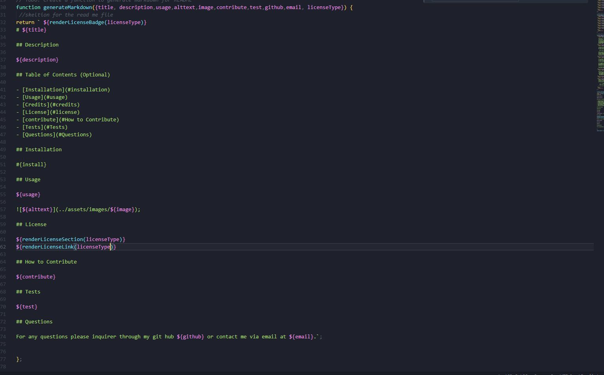

 
# UW Bootcamp Week 9 README generator

## Description

This project was built in order to save time making README files. It allows the user to spend more focus on the content and less about missing elements or formating. I learnde while building this aplaction how to better use inquirer along with how to have two js elements comunacate with eachother.

## Table of Contents (Optional)

- [Installation](#installation)
- [Usage](#usage)
- [Credits](#credits)
- [License](#license)
- [Contribute](#How-to-Contribute)
- [Tests](#Tests)
- [Questions](#Questions)

## Installation

To use this aplacation please install nodejs 18.16.0, inquirer@8.2.4, and day js. Also download the project files onto your computer.

## Usage

To use this product please take an image of your aplacation and place it in the images file, the cd into the folder containing the index.js file and run "node .\index.js" in your terminal, then respond to the questions.
Video example : https://youtu.be/NS6VeFsQp70
;

## License

Copyright 2023, DuckTurtle

    Permission is hereby granted, free of charge, to any person obtaining a copy of this software and associated documentation files (the “Software”), to deal in the Software without 
    restriction, including without limitation the rights to use, copy, modify, merge, publish, distribute, sublicense, and/or sell copies of the Software, and to permit persons to whom 
    the Software is furnished to do so,subject to the following conditions:
    The above copyright notice and this permission notice shall be included in all copies or substantial portions of the Software.
    THE SOFTWARE IS PROVIDED “AS IS”, WITHOUT WARRANTY OF ANY KIND, EXPRESS OR IMPLIED, INCLUDING BUT NOT LIMITED TO THE WARRANTIES OF MERCHANTABILITY, FITNESS FOR A PARTICULAR PURPOSE 
    AND NONINFRINGEMENT. IN NO EVENT SHALL THE AUTHORS OR COPYRIGHT HOLDERS BE LIABLE FOR ANY CLAIM, DAMAGES OR OTHER LIABILITY, WHETHER IN AN ACTION OF CONTRACT, TORT OR OTHERWISE, 
    ARISING FROM, OUT OF OR IN CONNECTION WITH THE SOFTWARE OR THE USE OR OTHER DEALINGS IN THE SOFTWARE.
(https://opensource.org/licenses/MIT)

## How to Contribute

You can contribute by adding new fetures or fixing and bugs you may come across.

## Tests

You can test this aplacation using jest or trying your hardest to break the prompts.

## Questions

For any questions please inquirer through my git hub DuckTurtle or contact me via email at qschnell04@gmail.com.
